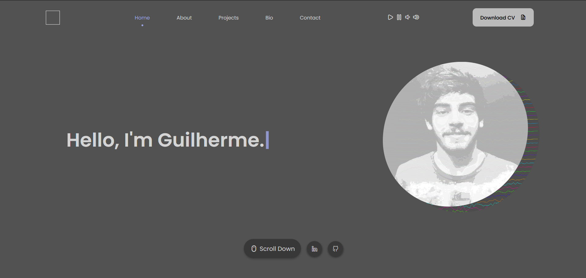

<h1 align="center">
   💻Portfólio - Guilherme Milani
</h1>

<h4 align="center"><a href="https://guimilani.github.io/">Clique para visitar o projeto</a></h4>

## 📜 Header

O header tem 4 itens interativos:

- **Logo:** O logo escolhido foi um quadrado que rotaciona conforme o scroll da página para trazer um tipo de feedback háptico;
- **Seções:** Aqui é possível pular para alguma das seções do site e também ver qual a seção que está em visualização atualmente;
- **Player:** Temos um player de música que transmite a [NTS Radio](https://www.nts.live/), especificamente a estação de músicas dos gêneros ambient/drone;
- **Botão:** Um simples botão para realizar o download do meu Curriculum vitæ;

---

## 📚 Seções

O site é composto por 5 seções:

- **Home:** Nele temos uma tela simples com frases se alteranando com um efeito de digitação e uma animação exibindo uma imagem minha;
- **About:** Nessa seção trago uma descrição sobre meus conhecimentos e mini cards com algumas das ferramentas que sei utilizar;
- **Experience:** Aqui temos cards para algumas experiências de trabalho que já tive, com uma breve descrição abaixo;
- **Bio:** Apresenta mais informações pessoais sobre mim, sobre o site e outras qualidades que possuo como profissional, além de uma arte generativa em p5.js;
- **Contact:** Exibe informações para contato e um formulário que pode me enviar o nome do visitante do site, seu email para contato e um breve texto;

---

## 💼 Tecnologias utilizadas

Para o desenvolvimento deste site utilizei as seguintes tecnologias:

- HTML;
- CSS;
- JavaScript;
- ScrollReveal;
- p5.js;

---

<h2>👤 Autor</h2>

<table>
  <tr>
    <td align="center">
      <a href="https://github.com/guimilani">
         
        
          <b>Guilherme Milani</b>
        
      </a>
    </td>
  </tr>
</table>